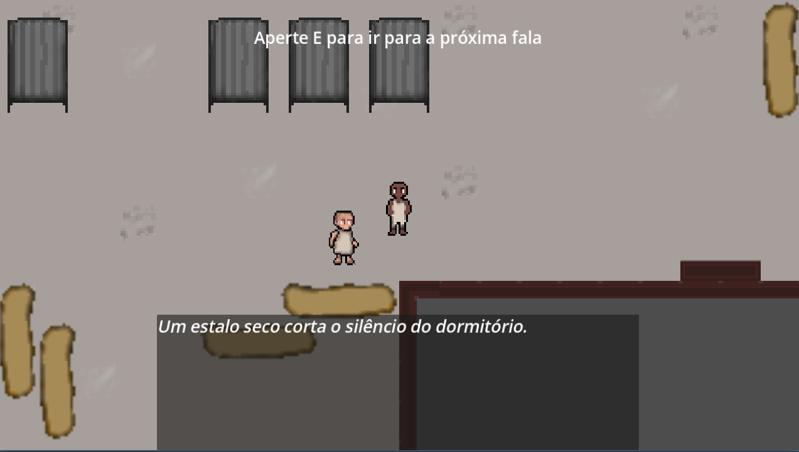
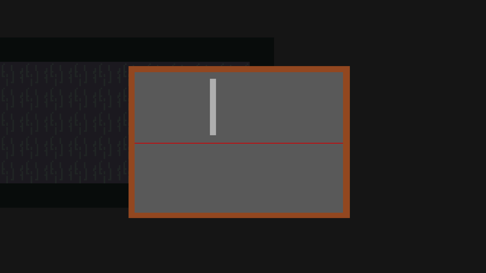

# Inferno no Sul

## Grupo

- Arthur Lara
- Lucas Neiss
- Kauã Vitor
- Rafael Valdivio

## Sobre o jogo

No livro "A História da Loucura", o filósofo Michel Foucault expõe que, na sociedade atual, a caracterização do "louco" é normalmente atribuída àqueles que são vistos como indesejados para o convívio social, e não unicamente àqueles que apresentam algum transtorno passível de tratamento. Com isso, muitas das internações em instituições médicas têm como propósito afastar da comunidade os indivíduos percebidos como não aptos para interações humanas.

Esse novo pensamento constituiu um fundamento para a luta antimanicomial em todo o mundo, dado que, há séculos, claras violações humanitárias ocorriam nessas casas de tratamento. Entretanto, tal processo, como todas as coisas que existem no planeta, ocorreu de forma desigual ao redor do globo. Se em locais na Europa manicômios eram fechados e os tratamentos, revitalizados, localidades como o Brasil, onde instituições de tratamento psicológico — e fica aqui o questionamento se elas podem mesmo ser chamadas disso, e não de instituições de tortura —, como o Hospital Colônia de Barbacena, continuavam recebendo milhares de pacientes por ano fadados à realidade da morte, da desnutrição, da humilhação, da zoomorfização e da invisibilização.

O jogo Inferno no Sul traz, portanto, ao grande público, a realidade esquecida e negligenciada das casas de tratamento psiquiátrico que existiam principalmente em países em piores condições socioeconômicas, majoritariamente no Sul Global, a fim de que a luta antimanicomial seja não somente relembrada, como incentivada.

## Mecânicas principais

Inferno no Sul é um jogo 2D de exploração, terror e sobrevivência. Entre as principais mecânicas implementadas estão:

- movimentação livre em ambiente 2D;
- corrida com sistema de stamina;
- possibilidade de o personagem se agachar para se movimentar de maneira mais discreta;
- sistema de ruído, no qual diferentes formas de movimentação produzem diferentes níveis de som;
- inimigos capazes de perceber o jogador tanto pela visão quanto pelos sons produzidos;
- inteligência artificial com comportamentos de patrulha, procura e perseguição;
- transição entre diferentes áreas do hospital por meio de portas;
- portas com diferentes estados, podendo estar trancadas, desbloqueadas ou abertas;
- minigame de lockpick para desbloqueio de determinadas portas;
- interação com objetos e elementos do cenário;
- coleta de documentos e outros elementos de lore;
- inventário para consultar conteúdos encontrados durante a exploração;
- diálogos responsáveis por apresentar a narrativa e orientar a progressão do jogador;
- companheiro que acompanha o jogador durante determinadas partes da história;
- habilidades do companheiro, incluindo distração de inimigos, arremesso de objetos e auxílio na abertura de portas;
- possibilidade de utilizar pedras e outros ruídos para chamar a atenção dos inimigos;
- sistema de transição que mantém o companheiro junto ao jogador ao mudar de área;
- menu de pausa e configurações durante a partida.

  

  <em>Exploração do dormitório e sistema de diálogos.</em>

### Furtividade e perseguição

O jogador deve controlar a forma como se movimenta pelo cenário. Correr permite escapar mais rapidamente, porém consome stamina e produz mais ruído. Agachar-se reduz a velocidade, mas também diminui o som produzido.

Os inimigos podem investigar sons, procurar o jogador após detectá-lo e iniciar perseguições. Dessa forma, o jogador deve decidir quando correr, quando se esconder e quando utilizar distrações.

### Sistema de companheiro

Durante parte da campanha, o jogador é acompanhado por um NPC que pode auxiliá-lo na exploração.

Entre suas habilidades estão:

- distrair inimigos;
- arremessar objetos;
- auxiliar em determinadas fechaduras;
- lançar pedras para produzir ruídos e atrair inimigos;
- acompanhar o jogador entre diferentes áreas do hospital.

Essas habilidades fazem com que o companheiro também participe das decisões estratégicas do jogador.

### Lockpick

Determinadas portas não podem ser abertas apenas pela interação convencional.

Para avançar, o jogador deve completar um minigame de lockpick, acertando os comandos no momento correto. Caso falhe, pode realizar uma nova tentativa.

Essa mecânica é utilizada para tornar a exploração e a abertura de novas áreas mais interativas.

  

  <em>Minigame utilizado para desbloquear determinadas portas.</em>

### Exploração e lore

Ao explorar o hospital, o jogador pode encontrar documentos e outros registros relacionados à história do local.

Os conteúdos encontrados são armazenados em um inventário próprio e podem ser consultados posteriormente, permitindo que o jogador descubra gradualmente informações sobre o ambiente, os personagens e o contexto histórico abordado pelo jogo.

## Controles

Os controles podem ser remapeados no menu de configurações.

Controles padrão:

- **W, A, S, D:** movimentação;
- **E:** interagir;
- **Shift:** correr;
- **C:** agachar;
- **I:** abrir inventário;
- **Esc:** pausar o jogo.

Algumas ações relacionadas ao companheiro possuem comandos próprios durante a partida.

## Considerações éticas

Por tratar de temas sensíveis, como violência institucional, exclusão social, sofrimento psíquico e preconceitos históricos, o jogo foi pensado com uma preocupação ética.

A representação desses elementos não tem como objetivo reforçar estigmas ou reproduzir preconceitos, mas sim denunciar práticas violentas e contribuir para a memória histórica.

## Tecnologias utilizadas

- Godot Engine;
- GDScript;
- Obsidian para organização da narrativa e documentação;
- GitHub para versionamento e colaboração no desenvolvimento do projeto.

## Acessibilidade

Desde o desenvolvimento inicial, o projeto considera critérios de acessibilidade para melhorar a experiência dos jogadores.

Entre os recursos já presentes ou considerados durante o desenvolvimento estão:

- remapeamento dos principais controles;
- controles simplificados por teclado e mouse;
- controle de volume geral;
- controle separado de música e efeitos sonoros;
- ajuste de sensibilidade;
- ajuste do tamanho da fonte;
- escolha de resolução;
- opção de tela cheia;
- textos e interfaces desenvolvidos com foco em legibilidade;
- uso de informações visuais junto às interações do jogador;
- preocupação para que informações importantes não dependam exclusivamente de elementos sonoros.

  

  

  <em>Menu de configurações com opções de vídeo, áudio e acessibilidade.</em>

## Créditos

Os créditos do jogo apresentam os integrantes responsáveis pelo desenvolvimento do projeto.

  

O planejamento de acessibilidade do projeto foi realizado com base no checklist adaptado de **Game Accessibility Guidelines**.

Planilha de acessibilidade:
https://docs.google.com/spreadsheets/d/1T6EUtYraau1Bxbe5KdtQz_q8fqN3ysJ5/edit?usp=sharing&ouid=112009763357085195715&rtpof=true&sd=true
